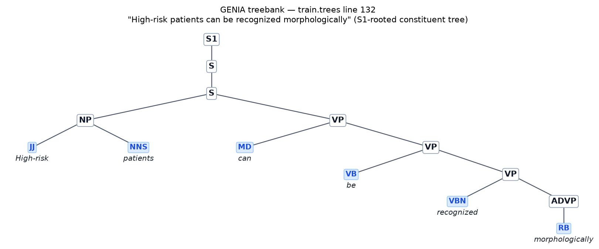

# rvnn-text — 递归神经网络 (RvNN) 文本生成

一个基于 **PyTorch** 的**递归神经网络（Recursive Neural Network, RvNN）**实现，以**文本生成**为演示，
并阐释 RvNN 与**文法分析（parsing）**之间的内在联系。

- **不是 RNN**：RNN（循环神经网络）把文本当作一条**线性序列**从左到右处理；
  RvNN 则把文本当作一棵**句法树（parse tree）**，自底向上递归地组合子节点向量。
- **文法约束生成**：解码器在**上下文无关文法（CFG）**的约束下自顶向下展开，因此生成的句子**永远合乎语法**。
- **段落级递归**：内置故事文法 `Story → S | S Story`，一段话就是一棵多句树，模型在段落层面同样递归。
- **Cloze 填空 & 自动续写**：训练时随机 mask 叶子（树版 MLM），推理时用编码-解码重建被 mask 的单词，
  因此能**填空**、也能**续写**出与原文不同但合法的句子。
- 纯 PyTorch 实现，支持 CUDA / MPS（Apple Silicon）/ CPU，设备自动选择。

---

## 目录

- [RvNN 原理](#rvnn-原理)
- [与文法分析的联系](#与文法分析的联系)
- [应用](#应用)
- [安装](#安装)
- [使用方法](#使用方法)
- [演示结果](#演示结果)
- [实验](#实验)
- [项目结构](#项目结构)
- [数据来源](#数据来源)
- [扩展方向](#扩展方向)

---

## RvNN 原理

### 递归 vs 循环：结构决定了模型

RNN（Recurrent Neural Network）隐含地假设输入是一个**链式结构**——每个词只依赖它左边的词：

```
RNN:  w1 → w2 → w3 → ... → wn     (线性序列)
```

而自然语言的句法结构是**树状的**，不是线性的。句子 *"the happy cat sees a dog"* 的句法分析树是：

```
            S
          /   \
        NP     VP
       / \     / \
     Det NOM Verb  NP
      |  / \   |   / \
     the Adj NOM sees Det NOM
          |  / \      |   |
        happy Noun    a  Noun
               |          |
              cat        dog
```

RvNN（Recursive Neural Network）沿着这棵树**递归**地组合向量：叶子（单词）先有各自的词向量，然后每
个内部节点把子节点的向量组合成父节点的向量。**同一个组合函数在每一个内部节点反复使用**——这正是
"递归"的含义（recursion，而非 recurrence）：

```
p = tanh( W_left · c_left + W_right · c_right + b )      # 二叉节点
p = tanh( W_unary · c + b_unary )                        # 一元节点
```

其中 `c_left`、`c_right` 是子节点向量，`p` 是父节点向量，`W_*`、`b` 是**全树共享**的参数。

### 为什么是树而不是序列？

1. **组合语义（compositionality）**：短语的含义由部分的含义与组合方式决定——这是形式语义学
   （Frege 的语义组合原则）的核心思想，也是 RvNN 的归纳偏置。
2. **长距离依赖**：对平衡树，从叶子到根的路径长度是 `O(log n)`，而 RNN 中两个相距很远的词之间隔着
   `O(n)` 步，梯度容易消失。树结构天然缩短了信息传播的路径。
3. **结构化输出**：RNN 只能输出序列；RvNN 天然适合"输入是树 / 输出是树"的任务（如句法分析、
   程序抽象语法树）。

### 本项目中的模型

`rvnn_text.model.RvNNText` 是一个**递归自编码器（recursive autoencoder）**：

- **编码器（自底向上）**：叶子 = 词向量；内部节点 = 共享组合函数 `tanh(W_l h_l + W_r h_r + b)`，
  最终整句话被压缩为一个向量 `h_root`。
- **解码器（自顶向下）**：从一个可学习的起始向量出发，在每个内部节点 (a) 预测一条**产生式规则**
  （如 `NP → Det NOM`），(b) 把父向量**投影**为各内部子节点的向量并递归，直到到达词性叶子时采样单词。
- **训练目标**：
  1. **规则交叉熵**：用节点向量预测该节点的产生式规则（监督信号，训练编码器）；
  2. **单词交叉熵**：用**父节点**向量预测其词性子节点的单词（监督信号）；
  3. **重构损失**：解码投影应能近似还原编码器的自底向上向量（**目标 detach**，只训练解码投影，
     避免二者相互拉扯导致向量塌缩）。

关键细节：单词预测以**父节点向量**为条件（而非叶子自身的向量），否则"用词向量预测它自己对应的
词"是平凡退化问题。

### 判别式的 RvNN 怎么"重构"与"生成"？（递归自编码器，而非变分）

**经典 RvNN 确实是判别式的**：Socher 2011 / 2013 的 RvNN 只有编码器——把句法树组合成一个向量，
然后接一个分类头做情感分析等任务。它**没有生成能力**，因为它从不"逆向"把向量展开回树。

本项目要重构（round-trip）与生成，靠的是**递归自编码器（recursive autoencoder, RAE）**路线，
**不是变分 RvNN（VAE-RvNN）**。二者的区别在于"潜变量怎么处理"：

| | 判别式 RvNN（Socher 分类器） | **本项目：递归自编码器（RAE）** | 变分 RvNN（VAE-RvNN） |
|---|---|---|---|
| 编码器 | 有（树 → 向量） | 有（树 → 向量，标准 RvNN） | 有（树 → μ, σ²） |
| 解码器 | **无** | **有**：确定性自顶向下逆变换 | 有：从 z ~ N(μ, σ²) 采样后展开 |
| 潜变量 | — | 确定性根向量 `h_root`（点估计） | 随机向量 z（后验分布） |
| 训练目标 | 分类交叉熵 | 重构 MSE（detach）+ 规则/单词 CE | 重构 + **KL 正则** |

**解码器是什么**：RAE 把"组合函数"当作可逆的来学——每层一组线性投影
`D_left` / `D_right`（以及单元用的 `D_unary`），它们近似组合函数 `tanh(W_l·h_l + W_r·h_r + b)` 的逆。
解码时自顶向下：给定父向量 `h`，(a) 规则分类器选出产生式，(b) 用 `D_left/D_right` 投影出子节点向量并递归，
(c) 到词性叶子时由单词预测器从父向量采样单词。**每一步都被文法约束住**，所以展开结果永远合法。

**重构为什么能还原原句**：重构损失 `‖D_child(h_parent) − h_child‖²`（**目标 detach**——只训练解码投影、
不让编码器被解码器"拉塌缩"，这是 RAE 训练的经典要点）迫使投影真正成为组合的逆；贪心解码时每个
节点都取 argmax，就从根向量逐步还原出整棵树。

**生成为什么能造新句**：自由生成从可学习起始向量 `start_embedding`（+ 可选高斯噪声）出发，同样自顶向下
展开——噪声让每次落在 `h_root` 空间的不同位置，于是产生**与训练语料不同的新句子**。注意这里的
`start_embedding + 噪声` 只是生成时的**探索技巧**（点估计 + 抖动），**不是**变分模型学出来的先验分布
`p(z)`，也没有 KL 项；真正的 VAE-RvNN（学习 μ/σ、对 z 采样、加 KL 正则）是本项目的扩展方向之一
（见[扩展方向](#扩展方向)）。

**提示词条件生成（本项目 `generate_from_prompt`）**：把提示句解析、编码成根向量 `h`，再用解码器的
右投影 `D_right(h)` 得到"续写部分"的嵌入（训练时 `D_right` 的任务正是从 `Story` 根向量还原第二个
子句的向量），从该嵌入自顶向下展开出续写故事。因此续写中的每个词都**经由投影链受提示词向量支配**——
这是 RAE 内禀的条件生成机制，无需变分推断。

**参考文献**：解码端的思想来自 *Dynamic Pooling and Unfolding Recursive Autoencoders*（Socher et al.,
ICML 2011）——"unfolding" 就是自顶向下展开解码；RAE 的编码-解码训练框架见 *Dynamic Pooling and
Unfolding RAE* 与 *Semi-supervised Recursive Autoencoders*（Socher et al., 2011）。

---

## 与文法分析的联系

RvNN 与文法分析（parsing）的联系是**结构性的、不可分割的**：

1. **句法树就是 RvNN 的输入结构**。RvNN 处理的"树"，正是**上下文无关文法（CFG）**推导出的
   **成分句法树（constituency parse tree）**：`S → NP VP`、`NP → Det NOM`、`NOM → Adj NOM` 等产生式
   规则定义了树的形状，而 RvNN 沿着这棵树组合向量。**没有文法就没有这棵树，也就没有 RvNN 的递归结构。**

2. **RvNN 可以被当作一个"神经句法分析器"**。本项目的解码器在生成时预测每个节点的产生式规则；
   反向地，给定一棵树的向量表示，`evaluate()` 会度量"从向量还原出每个节点的产生式规则"的准确率。
   实验结果显示规则预测准确率达到 **100%**——也就是说，RvNN 在向量空间中**内化了文法**。

3. **递归 = 组合性**。文法的递归（`NOM → Adj NOM`）对应 RvNN 的递归组合。语法规定了"哪些成分可以
   组合成什么"，RvNN 学会了"如何把子向量组合成父向量"。

4. **经典文献**：Richard Socher 等人的工作正是把递归神经网络建立在此之上——
   - *Parsing Natural Scenes and Natural Language with Recursive Neural Networks* (ICML 2011)
   - *Recursive Deep Models for Semantic Compositionality Over a Sentiment Treebank* (EMNLP 2013)，
     即著名的 **Stanford Sentiment Treebank（SST）**，其情感标签就标注在成分句法树的每个节点上。

---

## 应用

- **情感分析**：SST 在句法树的每个短语节点标注情感，RvNN 自底向上组合得到整句情感（比"词袋"或
  RNN 更能刻画否定、修饰等组合语义）。
- **关系抽取 / 复述检测**：用句法树的组合向量计算短语或句子的语义相似度。
- **场景解析**：Socher 2011 将图像分割成区域，按区域树递归组合做语义分割。
- **代码 / 程序分析**：程序的抽象语法树（AST）同样是树，RvNN 可用于代码向量化、缺陷检测。
- **文法引导的生成**：在语法约束下生成结构化文本（本项目即为最小示例），常用于程序合成、SQL、
  公式生成等"语法必须正确"的场景。

---

## 安装

```bash
# 克隆并进入项目
git clone https://github.com/<your-name>/rvnn-text.git
cd rvnn-text

# 安装依赖（torch 已装可跳过）
pip install -r requirements.txt

# 以可编辑模式安装（可选，提供 rvnn-train / rvnn-generate / rvnn-demo 命令）
pip install -e .
```

依赖：`torch>=2.0`、`fire`（CLI）、`pytest`（测试）。

---

## 使用方法

### 1. 一键演示（推荐先跑这个）

```bash
python -m rvnn_text.demo
```

会依次展示：文法定义 → 采样出的**故事句法树**（一段话 = 一棵多句树）→ 训练过程 → 文法学习准确率
→ **新故事生成**（与原文不同的句子）→ **cloze 填空**（mask 单词后经编码-解码重建）→ **自动续写**
（mask 后半段后重建）→ **提示词条件生成**（给定 `[提示句]`，续写出更长的段落）。可调参数：

```bash
python -m rvnn_text.demo --num_sentences 1500 --epochs 20 --n_samples 6 --mask_frac 0.2
```

### 2. 训练

```bash
python -m rvnn_text.train --num_sentences 4000 --epochs 30 --dim 64 --story
```

| 参数 | 含义 | 默认 |
|---|---|---|
| `num_sentences` | 从文法采样的训练树数 | 4000 |
| `epochs` | 训练轮数 | 30 |
| `dim` | 词向量/隐层维度 | 64 |
| `lr` | 学习率 | 1e-3 |
| `recon_weight` | 重构损失权重 | 1.0 |
| `mask_frac` | 每棵树随机 mask 的叶子比例（树版 MLM，让模型学会 cloze / 续写；0 关闭） | 0.15 |
| `story` | 用多句故事文法训练（start=`Story`），否则单句文法 | False |
| `out_dir` | checkpoint 输出目录 | checkpoints |

训练结束后模型保存在 `checkpoints/rvnn_text.pt`。

### 3. 生成

```bash
# 从先验采样 8 句，并打印每句的句法树
python -m rvnn_text.generate --checkpoint checkpoints/rvnn_text.pt --n 8

# 贪心解码（每步取概率最大的规则/单词）
python -m rvnn_text.generate --greedy --n 5

# 编码一句话 → 从它的向量重新解码（round-trip / 复述演示）
python -m rvnn_text.generate --from_sentence "the happy cat sees a dog"
```

关键参数：`temperature`（采样温度，越大越随机）、`seed_noise`（起始向量的高斯噪声，控制多样性）、
`max_depth`（最大树深度，限制右递归 `NOM → Adj NOM` 造成的无限展开）。

### 4. 编程接口

```python
from rvnn_text import Grammar, RvNNText, make_corpus, get_device, set_seed
from rvnn_text.grammar import make_story_grammar
from rvnn_text.train import train_model

set_seed(42)
grammar = make_story_grammar()           # 多句故事文法（start=Story）
corpus = make_corpus(grammar, 4000)      # 采样故事树
model, _ = train_model(grammar, corpus, epochs=30, mask_frac=0.2, device=get_device())

print(model.generate_sentence(seed_noise=1.0))   # 生成全新故事（文法约束）

# cloze 填空：mask 第 1、3 个词，经编码-解码重建
r = model.cloze("the happy cat sees a dog", mask_indices=[1, 3], greedy=True)
print(r["input"], "->", r["output"])

# 自动续写：保留前 4 个词，mask 后半段并重建
r = model.continue_sentence("the happy small clever cat sees a red tree", keep=5)
print(r["input"], "->", r["output"])

# 提示词条件生成：给定提示句，续写出更长的段落（编码提示词 -> D_right 投影 -> 解码）
tree = model.generate_from_prompt("every clever girl likes a cat", temperature=0.9)
print(tree)  # Story 树：提示句逐字保留 + 续写句子
```

单句文法同样可用（`Grammar()`，start=`S`）。`generate_from_prompt` 的续写原理见
[判别式的 RvNN 怎么"重构"与"生成"](#判别式的-rvnn-怎么重构与生成递归自编码器而非变分)。

---

## 演示结果

以下为 `python -m rvnn_text.demo` 在 Apple Silicon（MPS）上的实测输出（1500 个故事、20 epochs、`dim=64`、`mask_frac=0.2`）。训练语料为内置文法合成的故事段落（见[数据来源](#数据来源)）。

### 1. 训练收敛

| epoch | loss   | rule    | word    | recon   | val     |
|-------|--------|---------|---------|---------|---------|
| 1     | 0.5316 | 0.0404  | 0.3561  | 0.1351  | 0.1095  |
| 5     | 0.3256 | 0.0003  | 0.2778  | 0.0475  | 0.0494  |
| 10    | 0.3178 | 0.0000  | 0.2855  | 0.0322  | 0.0345  |
| 15    | 0.3072 | 0.0000  | 0.2782  | 0.0290  | 0.0312  |
| 20    | 0.2932 | 0.0000  | 0.2686  | 0.0246  | 0.0270  |

规则损失（rule）在第 9 个 epoch 后归零（第 13 轮有一次回跳随即恢复）——模型完全掌握了产生式规则；
word 损失高于纯监督设置，是因为其中包含**被 mask 单词**的预测项（树版 MLM，见下方 cloze / 续写），
这部分本质上更困难；recon 损失持续下降，说明解码投影在逼近编码器。

### 2. 文法内化：held-out 准确率

```
held-out rule-prediction accuracy: 100.0%
held-out word-prediction accuracy: 100.0%
```

### 3. 全新故事生成（与训练语料不同的句子）

模型从先验（可学习根向量 + 高斯噪声）自顶向下采样出**从未出现在训练语料中**的新故事，且永远合乎文法：

```
a clever red robot sees slowly.
Bob likes quickly.
the small boy chases a robot.
the girl sees Alice. every happy red robot eats slowly.
```

递归规则 `NOM → Adj NOM` 可生成任意长度的形容词链，句法树保证其合法性：

```
Story
└── S
    ├── NP
    │   ├── Det: a
    │   └── NOM
    │       ├── Adj: clever
    │       └── NOM
    │           ├── Adj: red
    │           └── NOM
    │               └── Noun: robot
    └── VP
        ├── Verb: sees
        └── Adv: slowly
```

### 4. Cloze 填空（mask 单词 → 编码-解码重建）

mask 掉单词后，用 mask 向量自底向上编码，再让单词预测器从父节点向量补回——结果**合乎文法，且常常与原词不同**：

```
masked:  the [MASK] cat sees a dog
filled:  the red cat sees a dog              ← 原文是 happy，模型改成了 red

masked:  every clever girl [MASK] the robot
filled:  every clever girl eats the robot    ← 原文是 likes

masked:  a [MASK] tree chases quickly
filled:  a red tree chases quickly           ← 恰好与原词一致

masked:  Mary likes [MASK] small clever cat
filled:  Mary likes the small clever cat     ← 原文是 a，模型选了 the

sampled fill (temperature=0.5): the clever cat sees a dog
```

### 5. 自动续写（mask 后半段 → 重建）

把句子的后半段（或故事的第二句）全部 mask，模型基于保留的前缀续写出**语法正确、与原文不同**的结尾：

```
story:     the happy small clever cat sees a red tree
masked:    the happy small clever cat [MASK] [MASK] [MASK] [MASK]
completed: the happy small clever cat eats a red cat       ← 与原文不同

story:     Alice likes a cat Bob chases the dog
masked:    Alice likes a cat [MASK] [MASK] [MASK] [MASK]
completed: Alice likes a cat Alice eats every cat          ← 与原文不同
```

### 6. 提示词条件生成（`[提示句]` → 更长的段落）

给定一个合法的提示句，编码成根向量后经 `D_right` 投影驱动解码器续写（原理见
[判别式的 RvNN 怎么"重构"与"生成"](#判别式的-rvnn-怎么重构与生成递归自编码器而非变分)），
提示句逐字保留，续写出更长的段落：

```
prompt:    [every clever girl likes a cat]
generated: every clever girl likes a cat. every tree eats the happy tree. a small small clever tree sees loudly.

prompt:    [a red tree chases the happy boy]
generated: a red tree chases the happy boy. the red happy tree sees slowly.
```

> 说明：cloze 与续写均基于**自底向上编码 + 父节点向量预测**。对一棵树，某个被 mask 叶子的父节点
> 向量只由它自己的子节点（mask 与未 mask 的兄弟）构成，因此**名词**（其父节点是单元产生的 NOM）
> 的填空基本无上下文；而 **Det / Adj / Verb**（父节点为二叉节点）能真正利用上下文。要获得全局
> 上下文约束的续写，需要 TreeLSTM 式的自上而下信息流（见[扩展方向](#扩展方向)）。

---

## 实验

### 实验一：合成语料上的文法约束生成（递归自编码器）

#### 1. 实验步骤

1. **数据生成**：`make_corpus(grammar, 1500, seed=42)` 从内置故事文法采样 1500 棵故事树，按 9:1
   划分 train/val（`seed` 固定，完全可复现）。
2. **训练**：逐树 SGD（树结构异构，不做批处理）——Adam（`lr=1e-3`，梯度裁剪 5.0），20 epochs，
   `dim=64`，`mask_frac=0.2`（树版 MLM），`recon_weight=1.0`。
3. **评估**：`evaluate()` 度量 held-out 规则 / 单词预测准确率；随后依次执行新故事生成、cloze 填空、
   自动续写、提示词条件生成四个任务。
4. **环境**：Apple Silicon（MPS），PyTorch 2.x，单次完整训练约 8 分钟。

复现命令：`python -m rvnn_text.demo`（即执行上述全部步骤）。

#### 2. 数据说明

| 项 | 内容 |
|---|---|
| 数据来源 | **无外部数据集**——语料由内置文法合成、零下载，文法定义见 `rvnn_text/grammar.py`（`STORY_PRODUCTIONS`，start=`Story`） |
| 数据量 | 1500 棵树（1350 train / 150 val），每棵 1~4 个句子 |
| 数据格式 | 每棵树是一个递归的 `Node(symbol, word, children)` 结构，由 `data.make_corpus()` 采样生成 |

树的数据格式（即 demo 第 2 节的采样输出）：

```
Story
├── S
│   ├── NP
│   │   ├── Det: a
│   │   └── NOM
│   │       └── Noun: tree
│   └── VP
│       ├── Verb: sees
│       └── NP
│           └── Proper: Bob
└── Story
    └── S
        ├── NP
        │   └── Proper: Alice
        └── VP
            └── Verb: sees
```

对应代码结构：叶子 `Node("Noun", word="tree")`；内部节点 `Node("NP", children=[...])`。训练语料即
`list[Node]`；要换真实数据，只需把外部语料的成分句法树转成同样的 `Node` 表示（见[数据来源](#数据来源)）。

#### 3. 实验结果

- **文法内化**：held-out 规则预测准确率 **100%**、单词预测准确率 **100%**。训练 20 epochs 总损失
  `0.5316 → 0.2932`，规则损失第 9 个 epoch 归零，重构损失 `0.1351 → 0.0246`；
- **新故事生成**：从先验（可学习根向量 + 高斯噪声）采样出与训练语料**不同**的合法段落；
- **Cloze 填空**：mask 词被合理补回，4/5 示例与原文不同但合乎文法（如 `the [MASK] cat` → `the red cat`、
  `every clever girl [MASK] the robot` → `every clever girl eats the robot`）；
- **自动续写**：mask 后半段后重建，产出语法正确、与原文不同的结尾；
- **提示词条件生成**：提示句逐字保留，续写出更长的段落（如 `[every clever girl likes a cat]` →
  `every clever girl likes a cat. every tree eats the happy tree. a small small clever tree sees loudly.`）。

完整实测输出见[演示结果](#演示结果)。

### 实验二：SST-5 真实语料情感分析（判别式 RvNN）

#### 1. 数据

**Stanford Sentiment Treebank（SST-5）**——RvNN 的经典真实数据基准（Socher et al., 2013）：
<https://nlp.stanford.edu/sentiment/>

- **格式**：每行一棵括号树，每个节点带 0~4 情感标签（0 极负面 → 4 极正面），叶子为单词——
  内部节点**不含**句法类别符号（只有情感标签与结构），例如
  `(3 (2 (2 The) (2 Rock)) (4 (3 (2 is) (2 destined)) (2 .)))`；
- **规模**：8544 train / 1101 dev / 2210 test 句；本实验使用子集 **2000 train / 400 dev**（
  `--max_train` / `--max_dev` 可调）；
- 数据在首次运行时自动下载（`data/sst/trees.zip`，约 0.8 MB，不进入 git）。

#### 2. 实验步骤

1. 解析括号树 → 右分支**二值化**（n 元节点折叠为二叉脊，新节点继承父节点情感标签）；
2. 由训练树**归纳通用文法**：所有内部节点统一符号 `N`（`N → N N | W N | N W | W W | W`），
   叶子词性统一为 `W`（`W → 任意词`，OOV 映射为 `<unk>`）；
3. 训练：RvNN 编码器 + 5 类情感头，对**每个节点**的向量做情感交叉熵（Socher 式逐节点监督），
   并叠加解码器目标（规则/单词 CE + 重构，`aux_weight=0.3`）使模型**同时具备生成能力**；
   `dim=64`、Adam（lr=1e-3）、6 epochs；
4. 评估：**根节点**预测准确率 vs 多数类基线，并考察生成效果。

复现命令：`python -m rvnn_text.sst`（默认参数即上述设置；纯情感训练用 `--aux_weight 0`）

#### 3. 实验结果（Apple Silicon MPS）

| 指标 | 数值 |
|---|---|
| 多数类基线（恒预测类别 3） | 45.75% |
| **RvNN 根节点情感准确率**（含解码器训练） | **46.25%**（epoch 5 峰值 50.25%） |
| 纯情感训练（`--aux_weight 0`）可达 | 48.50% |
| 训练损失 | 2.3019 → 0.8540（6 epochs） |

> 情感与解码器目标存在权衡：`aux_weight=0.3` 时分类略降（46.25%），但换来生成能力；只做情感分类
> 可用 `--aux_weight 0`（48.50%，见上表）。

示例预测（dev）：

```
[ok ] A warm , funny , engaging film .                      true=4 pred=4
[ok ] Visually imaginative , ... and thoroughly delightful  true=4 pred=4
[ok ] And if you 're not nearly moved to tears ...          true=3 pred=3
[mis] It 's a lovely film with lovely performances ...      true=3 pred=4
```

#### 4. 生成任务：判别式 RvNN 能生成吗？（能，但质量受"无句法类别"制约）

训练时同步训练了解码器（RAE 目标），因此模型**可以自顶向下生成**。但生成质量恰好反衬出文法约束
对 RvNN 的关键作用（对比[实验一](#实验一合成语料上的文法约束生成递归自编码器)）：

**① 自由生成**（可学习起始向量 + 噪声）——SST 树没有句法类别，归纳文法对结构**零约束**，
解码器只能输出无序词流：

```
disturbing cartoon <unk> carries distant Silence children and and Jagger
Makes with with
```

**② 结构脚手架生成**（真实 SST 树形骨架 + 模型选词，温度 0.3）——句子**形状**是真实的，
单词由模型按电影评论风格挑选（近贪心取高概率词），但词序仍不成句：

```
original: It 's a lovely film with lovely performances by <unk> and <unk> .
regen:    . <unk> suggest pure <unk> it fails pleasingly intriguing Schmidt charisma Meyjes .

original: No one goes <unk> here , which is probably for the best .
regen:    and compelling <unk> consider Leigh universal <unk> Perhaps enjoyable real good excellent .
```

**③ 情感引导的脚手架生成**——把情感头第 0/4 类的权重方向加到根向量（activation steering），
**词汇层面的情感倾向清晰可见**（同一条真实句形）：

```
steered toward very negative (class 0):  . short its utterly wonder . hell Huppert killer along feature Korean .
steered toward very positive (class 4):  . <unk> Breaking ultimately standards wonderful 's and feeling subtlety feeling punch .
```

> **结论（教学点）**：RvNN 的生成质量与文法约束强绑定——实验一有文法（`S → NP VP` …）约束每一步
> 展开，生成 100% 合法；SST 标签树**没有句法类别**，归纳文法退化为"任意二叉"，解码器没有结构先验，
> 于是自由生成退化为词流。这正是"RvNN 与文法分析不可分割"的另一面：**结构约束（语法）不是装饰，
> 而是递归生成成立的前提**。改进方向：换用带完整句法标注的树库（如 PTB 全标注），或用 TreeLSTM 类
> 带门控的组合函数（见[扩展方向](#扩展方向)）。

### 实验三：GENIA 真实成分树库上的结构约束生成（真实文法）

实验二的失败点在于 SST 树**没有句法类别**。实验三换用 **GENIA Treebank**——带完整句法类别
（`S`/`NP`/`VP`/`PP`…）的真实生物医学成分树——验证：有了真实文法约束，真实数据上的生成是否恢复。

#### 1. 数据

**GENIA Treebank 1.0**（生物医学 Medline 摘要，PTB 风格成分树）——来源与下载见[数据来源](#数据来源)
（自动下载，约 1.5 MB）。规模：14,326 train / 1,361 dev；本实验使用 **2500 train / 400 dev**。
预处理：解析括号树 → 剔除标点叶子（`.` `,` `:` 等 7 个标点词性）→ 右分支二值化 → 按 `min_count=2`
过滤词表（OOV → `<unk>`）。

#### 2. 实验步骤

1. 由训练树**归纳真实文法**：内部类别保留原名（`S1 → S`、`NP → DT NN`、`NP → NP PP`…），
   每个词性标签（`NN`/`DT`/`JJ`…）作为自己的前终结符（`NN → gene`、`DT → the`…）；
   得到 **55 个类别、4635 条规则、3442 词**；
2. 训练：与实验一同款递归自编码器目标（规则 CE + 单词 CE + 重构 + `mask_frac=0.15`），
   `dim=64`、Adam（lr=1e-3）、8 epochs；
3. 评估：held-out 规则/单词预测准确率；再执行自由生成、cloze、自动续写。

复现命令：`python -m rvnn_text.genia --max_train 2500 --max_dev 400 --dim 64 --epochs 8`

#### 3. 实验结果（Apple Silicon MPS）

| 指标 | 数值 |
|---|---|
| held-out 规则预测准确率 | **88.2%**（4635 规则） |
| held-out 单词预测准确率 | **90.1%** |
| 训练损失 | 4.7526 → 1.1981（8 epochs） |

**① Cloze 填空（结构固定，词预测）** —— 能补出**真实的生物医学术语**：

```
masked:  ... cells and <unk> acid [MASK] ... cells from human monocytes
filled:  ... cells and <unk> acid okadaic ... cells from human monocytes     ← 术语 okadaic acid

masked:  We previously showed that ... factor M-CSF [MASK] the differentiation of human monocytes ...
filled:  We previously showed that ... factor M-CSF are the differentiation of human monocytes ...
```

**② 自动续写（结构固定，后半段全部 mask）** —— 生成语法正确的从句与名词短语：

```
masked:  We previously showed that ... colony-stimulating factor M-CSF [MASK] × 13
filled:  We previously showed that ... colony-stimulating factor M-CSF <unk> the protein of <unk> cells of patients

masked:  However in vivo not only <unk> but also [MASK] × 8
filled:  However in vivo not only <unk> but also <unk> cells are <unk> of <unk> cells
```

**③ 自由生成（结构也由模型采样）** —— 词汇全部真实（生物医学词表），但**结构开始漂移**：

```
These levels had Neither This studied out <unk> Most long-term heavy-chain DNAs toward vs. ...
p65 bcl-2 <unk>
integrity TNF line by a aging activated diffuse capacity in disease a status climacteric palindrome
```

> **结论（教学点）**：三个实验构成完整对照——**文法约束的"剂量"决定生成质量**：
>
> | 实验 | 文法约束 | 自由生成效果 |
> |---|---|---|
> | 一（玩具文法） | 规则准确率 100%，规则集小 | 句子 100% 合法 |
> | 二（SST，无类别） | 零约束 | 词汤 |
> | 三（GENIA 真实文法） | 规则准确率 88%，规则集 4635 条 | 词汇真实、结构漂移 |
> | 四（Simple Wiki 朴素文法） | 规则准确率 76%，规则集 3175 条 | 结构 100% 合规（脚手架），词分布真实、语义随机 |
>
> 而**结构固定**的任务（cloze / 续写）在三中表现良好——说明解码器已学会"按结构选词"，自由生成的
> 漂移主要来自**规则预测的剩余误差**与**缺少句子长度先验**。提升方向：更多数据/epochs 提高规则
> 准确率、加入长度控制（如先采样句子长度再解码）、TreeLSTM 门控组合（见[扩展方向](#扩展方向)）。

---

### 实验四：Simple Wikipedia 朴素风格生成（RvNN 编码-解码生成新段落）

承接实验三：有了真实文法，能否用 RvNN 的**编码-解码（递归自编码器）**生成一段**不在训练样本中**、
风格与训练样本里的朴素模板句 `A bridge spans this river` 一致的段落？

#### 1. 数据

**Parsed Simple English Wikipedia**（Brown BLLIP）——Simple English Wikipedia（<https://simple.wikipedia.org/>，
用基础词汇写成的百科）全量自动解析，PTB 风格成分树、一行一棵：
<http://bllip.cs.brown.edu/download/simplewiki.ptb>（自动下载，约 33 MB，**197,541 棵树**）。

为复现"朴素"风格，训练子集经过滤器筛出**朴素句**：`ROOT → S`、4–9 词、无从句/专名/数字/标点误标
（标点被解析器误标成 `JJ` 等词性的句子也剔除）——共 **22,380 句**（约占 11%），
例如 `A lemon is a yellow citrus fruit`、`A circle has a centre`。文法归纳后剔除左递归规则
（真实树库含 `NP → NP PP` 这类结构，递归下降解析器要求无左递归文法）。

#### 2. 实验步骤

1. 归纳朴素文法：**41 个类别、3175 条规则**（`S → NP VP`、`NP → DT NN`、`NP → DT NP`…）；
   词表按 `min_count=2` 过滤，并**强制保留风格锚点句的 3 个稀有词**（bridge/spans/river，
   在训练子集中各仅出现 1 次）以保证锚点句可解析；
2. 训练：与实验一/三同款 RAE 目标（规则 CE + 单词 CE + 重构 + `mask_frac=0.15`），
   `4000 train / 500 dev`、`dim=64`、Adam（lr=1e-3）、8 epochs；
3. **编码-解码生成**：解析锚点句 → 自底向上**编码**成根向量 `h` → 加高斯噪声 →
   沿锚点句骨架**解码**（每个内部节点用解码器逆投影 `D_left`/`D_right`/`D_unary` 得到子节点向量，
   每个词性位从词预测器采样单词，`<unk>` 的对数几率在解码时屏蔽）——结构继承自锚点句、内容全新。

复现命令：

```bash
python -m rvnn_text.simplewiki train --max_train 4000 --max_dev 500 --dim 64 --epochs 8 --min_word_count 2
PYTHONHASHSEED=0 python -m rvnn_text.simplewiki generate --seed 7 --temperature 0.4 --seed_noise 0.3
```

#### 3. 实验结果（Apple Silicon MPS）

| 指标 | 数值 |
|---|---|
| held-out 规则预测准确率 | **76.2%**（3175 规则） |
| held-out 单词预测准确率 | **78.8%** |
| 训练损失 | 3.9345 → 1.1380（8 epochs） |

**生成段落**（5 句，逐句经 token 序列比对确认**不在语料中**，novel）：

```
family air is a university. philosophy voice is this note. Climate power is a information.
war power is a space. history source spans a child.
```

- **结构 100% 合规**：5 句全部与锚点句同骨架 `DT NN VBZ DT NN`（主语 NP + 及物谓语 + 宾语 NP）；
- **锚点句影响可见**：`history source spans a child` 中的 `spans` 正是锚点句的动词——编码向量把
  "桥跨河"的搭配倾向传给了解码器（不同 seed 下反复出现 `spans a …`）；
- 词汇全部来自语料高频词（family/air/university/philosophy/note/power/space/history/source/child）。

> **诚实的局限**：判别式 RvNN 的词预测器**按词性独立采样**，没有语言模型式的语义连贯性先验——
> 因此句子的语法骨架完全合规、词汇常用，但**语义组合是随机的**（`family air` 这类搭配无意义），
> 也没有冠词一致性（`a information`）。这与实验二"词汤"同源：RvNN 学到的是**结构与词分布**，
> 不是语义。若要语义连贯需叠加语言模型解码（RvNN 结构 + LM 选词），列为扩展方向。

> **附加观察（自由生成坍缩）**：不做脚手架、直接从先验解码时，生成会**坍缩到语料众数**
> （本实验为 `He is <unk> …`，因传记类文章以 `He is …` 开头最多）——这是"稀疏真实文法 +
> 先验采样"的固有行为；结构脚手架是把解码器引导回合法空间的实用手段（与实验二/三同机制）。

## 项目结构

```
rvnn-text/
├── rvnn_text/
│   ├── grammar.py      # 上下文无关文法、句法树、采样 / 解析 / 树可视化
│   ├── model.py        # RvNN 编码器 + 文法约束递归解码器、训练目标、评估
│   ├── data.py         # 从文法生成语料、train/val 划分
│   ├── train.py        # 训练循环（fire CLI）
│   ├── generate.py     # 生成（fire CLI）
│   ├── sst.py          # 实验二：SST-5 真实语料情感分析（判别式 RvNN，fire CLI）
│   ├── genia.py        # 实验三：GENIA 真实成分树库上的结构约束生成（fire CLI）
│   ├── simplewiki.py   # 实验四：Simple Wikipedia 朴素风格 RvNN 编码-解码生成（fire CLI）
│   ├── demo.py         # 端到端演示（fire CLI）
│   ├── checkpoint.py   # 模型保存 / 加载
│   └── utils.py        # 设备选择、随机种子
├── tests/              # pytest 测试（文法、模型、端到端）
├── pyproject.toml
└── requirements.txt
```

运行测试：

```bash
python -m pytest
```

---

## 数据来源

**实验一（合成）**：语料由内置文法（`DEFAULT_PRODUCTIONS` / `STORY_PRODUCTIONS`，见
`rvnn_text/grammar.py`）随机采样生成，零下载、可复现（`seed` 固定）；每棵树带完整句法标注。

**实验二 / 三（真实）**：

| 实验 | 数据 | 地址（自动下载） | 说明 |
|---|---|---|---|
| 实验二 | Stanford Sentiment Treebank (SST-5) | <https://nlp.stanford.edu/sentiment/> | 括号树 + 逐节点 0~4 情感标签，**无句法类别** |
| 实验三 | **GENIA Treebank 1.0**（生物医学） | <http://bllip.cs.brown.edu/download/genia1.0-division-rel1.tar.gz> | PTB 风格成分树，**带完整句法类别**（S/NP/VP/PP…），14,326 train / 1,361 dev |
| 实验四 | **Parsed Simple English Wikipedia** | <http://bllip.cs.brown.edu/download/simplewiki.ptb>（Simple Wikipedia <https://simple.wikipedia.org/>） | PTB 风格成分树，197,541 句；朴素子集 22,380 句 |

### 数据格式示例（GENIA 成分树）

实验三所用 GENIA 的每行是一棵**括号表示（PTB 风格）的成分树**：内部节点带句法类别
（`S1`/`S`/`NP`/`VP`…），叶子为「词性 + 单词」。原始格式摘自 `train.trees` 第 132 行：

```
(S1 (S (S (NP (JJ High-risk) (NNS patients)) (VP (MD can) (VP (VB be) (VP (VBN recognized) (ADVP (RB morphologically))))) (. .))))
```

该行含 6 个实词——*High-risk patients can be recognized morphologically*（生物医学典型的被动句）。
预处理后（剔除标点叶子、右分支二值化，即模型实际看到的树），绘制成树形图：



> **关于标注约定**：`S1` 是 GENIA 特有的顶层节点（每条句子唯一，全语料 100% 用作句根）；句末标点
> **不并入任何短语**，而是作为主句的兄弟节点挂在高一层 `S` 之下，于是原始标注出现
> `S1 → S → S` 的"双 S"骨架（占全部句子的 92%）。标点叶子的词性标签就是标点本身——
> `(. .)` 表示「词性 `.` + 单词 `.`」（PTB 惯例，逗号 `(, ,)`、冒号 `(: :)` 同理）；这既是预处理必须
> 剔除它们的原因之一（标签与单词同形，且 `nn.ModuleDict` 的键不能含 `.`），也解释了为什么处理后的
> 树是 `S1 → S → S → …` 一元链——标点被剔除后，外层 `S` 只剩一个子节点（主句 `S`）。

- **读取方式**：递归括号——`(类别 子节点…)`，叶子 `(词性 单词)`；词性标记含义：`JJ` 形容词、
  `NNS` 复数名词、`MD` 情态动词、`VB`/`VBN` 动词原形/过去分词、`RB` 副词；
- **预处理**：剔除 7 个标点词性（`.` `,` `:` `'` `` ` `` `-LRB-` `-RRB-`）→ 右分支二值化 →
  词表过滤（`min_count=2`，OOV → `<unk>`）→ 转成 `rvnn_text.grammar.Node`；
- **文法归纳**：从全部训练树统计产生式（如 `NP → JJ NNS`、`VP → VBN ADVP`），得到 **55 个类别 /
  4635 条规则**——这正是实验三里 RvNN 学到的结构约束。

### 其他带明确文法结构的树库（已验证可达，未在本仓库使用）

| 类型 | 数据 | 地址 | 说明 |
|---|---|---|---|
| 成分树 | BLLIP-LSA（Brown） | <http://bllip.cs.brown.edu/download/> | 华尔街日报+北美人报，PTB 风格带类别；树库本体需研究注册 / LDC 付费（页面上的 tar 为解析器模型） |
| 成分树 | TIGER 语料库（德语） | <https://www.ims.uni-stuttgart.de/forschung/ressourcen/korpora/tiger/> | 约 4 万句德语成分树，研究许可 |
| 成分树 | GENIA（生物医学） | <http://www.geniaproject.org/> | 本仓库实验三所用，官方项目主页 |
| 成分树 | Penn Treebank (PTB) | <https://catalog.ldc.upenn.edu/LDC99T42> | 黄金标准，**LDC 付费** |
| 依存树 | Universal Dependencies v2.18 | <https://universaldependencies.org/>（发布包 <https://lindat.mff.cuni.cz/repository/xmlui/handle/11234/1-6149>） | 100+ 语言（含中文），完全免费、无注册，主谓/动宾等依存关系 |
| 依存树 | Perseus 古典语树库 | <https://perseusdl.github.io/treebank_data/> | 古希腊语 / 拉丁语，免费 |
| 依存树 | BulTreeBank（保加利亚语） | <http://bultreebank.org/> | 免费 |

> 通用数据站（UCI <https://archive.ics.uci.edu/> / Kaggle <https://www.kaggle.com/> / IEEE DataPort
> <https://ieee-dataport.org/>）以机器学习任务数据为主，**不含句法树**，本仓库实验未使用；若要给任意
> 纯文本生成句法树，可用现成 parser（Stanford Parser / Berkeley Parser / spaCy）。

接入真实数据的方法：把外部语料的成分句法树转换成 `rvnn_text.grammar.Node`（叶子为词性 + 单词，
内部节点为短语类别），再复用 `train_model` 即可。若只有裸文本（无句法标注），可先用现成 parser
（如 Stanford Parser、spaCy）产出成分树，或把文本的词汇/句式吸收进自定义文法后照常采样训练。

---

## 扩展方向

- **变分先验（VAE）**：当前的生成先验是"可学习均值向量 + 高斯噪声"，解码会偏向某个区域。
  改为变分自编码器（对根向量学习均值/方差并加 KL 正则）可得到平滑、可控的生成分布。
- **真实数据（已实现）**：实验二在 SST-5 上做根节点情感分类、实验三在 GENIA 成分树库上做结构约束
  生成、实验四在 Simple Wikipedia 上做朴素风格编码-解码生成（见[实验](#实验)）；进一步可用全量
  GENIA/PTB、更大 dim 与预训练词向量提升质量。
- **递归批处理**：当前按树逐个训练；对同构子树做批处理（如 TreeLSTM 的批处理技巧）可显著加速。
- **更丰富的组合函数**：如 Recursive Neural Tensor Network（Socher 2013）、Gated RvNN（TreeLSTM）。
- **任意文法**：`Grammar` 支持自定义产生式（arity ≤ 2），可直接换成中文、代码或 SQL 的文法。

---

## License

MIT
